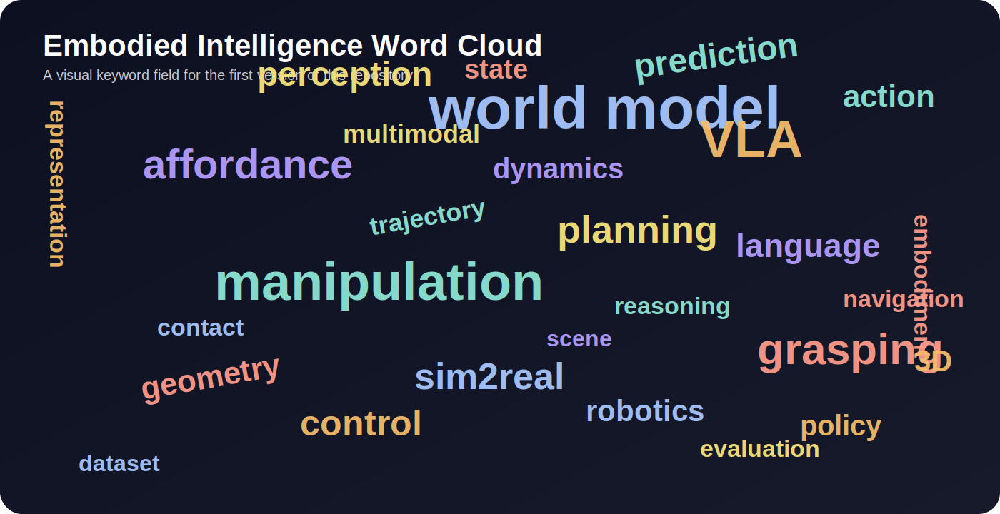

<div align="center">


# Embodied Intelligence Playbook

**A curated open-source playbook for embodied intelligence**  
**roadmaps, papers, practical checklists, visual maps, project links, and reproducible resources**

[](LICENSE)
[]()
[]()

</div>

---

## What is this?

**Embodied Intelligence Playbook** is a structured research-and-practice atlas for embodied AI.

It is designed to be more than a paper index. The goal is to make the field **navigable**, **buildable**, and **memorable**:

- **navigable**, because major directions are organized as readable roadmaps rather than loose bookmarks
- **buildable**, because each topic is tied to concrete system questions, project paths, datasets, codebases, and implementation cues
- **memorable**, because the repository uses visual structure, topic-specific styling, and compact conceptual diagrams

---

## Why this repository feels different

Many repositories are broad collections. This one tries to become a **designed entry point**.

It is built around four ideas:

1. **Direction before detail** — first understand the shape of a topic, then dive into papers.
2. **Practice before accumulation** — code, data, and reproducibility matter as much as citations.
3. **Recent + classic curation** — 2025–2026 frontier work is mixed with a compact classic foundation.
4. **Academia + industry maps** — readers can follow not just papers, but also labs, companies, and open projects.

---

## Visual Field

<p align="center">
  
</p>

<p align="center">
  
</p>

---

## Quick Start

### Start from the big picture
- [Overview](docs/roadmap/overview.md)

### Choose a core direction
- [Vision-Language-Action](docs/roadmap/vla.md)
- [World Models](docs/roadmap/world_model.md)
- [Reinforcement Learning](docs/roadmap/rl.md)
- [Manipulation](docs/roadmap/manipulation.md)
- [Grasping](docs/roadmap/grasping.md)
- [Affordance Learning](docs/roadmap/affordance.md)

### Explore practical resources
- [Datasets](docs/resources/datasets.md)
- [Simulators](docs/resources/simulators.md)
- [Frameworks](docs/resources/frameworks.md)
- [Conferences & Journals](docs/resources/venues.md)
- [Academic Labs & Universities](docs/resources/academia_map.md)
- [Industry & Company Projects](docs/resources/industry_map.md)

### Keep notes in a consistent format
- [Paper Note Template](docs/templates/paper_note_template.md)

---

## Topic Gallery

| Topic | Core Question | What you will find |
|---|---|---|
| Vision-Language-Action | How do perception and language become executable action? | recent 2025–2026 VLAs, classic milestones, project pages, open training stacks |
| World Models | How should an embodied agent represent and predict a changing world? | latent dynamics, video world models, planning bridges, recent robot world-model work |
| Reinforcement Learning | How should agents improve through interaction, reward, and planning? | RL-for-robotics roadmap, sim-to-real toolchains, classic + recent RL systems |
| Manipulation | How do robots complete tasks under contact and uncertainty? | long-horizon skills, imitation/RL links, datasets, teleop and evaluation pointers |
| Grasping | How does a robot choose and verify stable, task-appropriate interaction? | benchmarks, point-cloud methods, task-oriented grasping, real-time systems |
| Affordance Learning | What actions are possible on an object, where, and why? | functional semantics, interaction regions, part-level datasets, grounded action cues |

---

## New in the current curation pass

- added a full **Reinforcement Learning** roadmap
- expanded topic pages with **recent 2025–2026 work** plus compact classics
- added **academic institution map** for Stanford, Berkeley, CMU, Tsinghua, PKU, Fudan, SJTU, ZJU, Nanjing University, and USTC
- added **industry project map** for Google DeepMind, Meta, NVIDIA, ByteDance Seed, Alibaba DAMO, Huawei, Meituan, OpenAI, and selected frontier robotics companies
- expanded venue coverage to include major conferences and journals used by embodied-AI researchers

---

## Repository Design

```text
embodied-intelligence-playbook/
├── README.md
├── assets/
│   └── figures/
├── docs/
│   ├── roadmap/
│   ├── resources/
│   ├── paper_lists/
│   │   ├── by_topic/
│   │   ├── by_conference/
│   │   └── by_journal/
│   └── templates/
└── .github/
```

### Design notes
- `roadmap/` contains conceptual pages with reading strategy and project guidance
- `resources/` gathers datasets, simulators, frameworks, venues, and institution maps
- `paper_lists/` stores topic-based, conference-based, and journal-based entry lists
- `assets/figures/` stores original visuals created specifically for this repository

---

## Suggested Reading Paths

### Path A — new to embodied AI
1. Read [Overview](docs/roadmap/overview.md)
2. Read [Vision-Language-Action](docs/roadmap/vla.md) and [Manipulation](docs/roadmap/manipulation.md)
3. Use [Datasets](docs/resources/datasets.md) and [Frameworks](docs/resources/frameworks.md) to pick a reproducible stack

### Path B — interested in world models and RL
1. Read [World Models](docs/roadmap/world_model.md)
2. Pair it with [Reinforcement Learning](docs/roadmap/rl.md)
3. Follow [MuJoCo Playground](docs/resources/simulators.md), [Isaac Lab](docs/resources/frameworks.md), and recent world-model RL entries in the topic pages

### Path C — looking for real institutions and projects to follow
1. Open [Academic Labs & Universities](docs/resources/academia_map.md)
2. Open [Industry & Company Projects](docs/resources/industry_map.md)
3. Cross-reference the project links with the topic pages and paper lists

---

## Principles for Future Growth

This repository will grow under these principles:

- **clarity over clutter**
- **cohesion over noise**
- **practice over trend-chasing**
- **recent work with explicit links**
- **structure before scale**

---

## Contributing

This project welcomes high-quality contributions:

- roadmap improvements
- paper summaries
- visual topic maps
- reproduction notes
- resource curation
- issue-driven improvements to structure

Please see [CONTRIBUTING.md](CONTRIBUTING.md).

---

## License

This project is released under the [MIT License](LICENSE).
