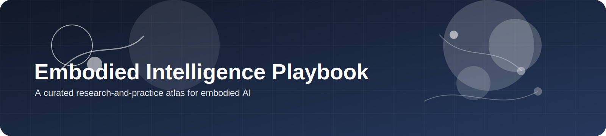
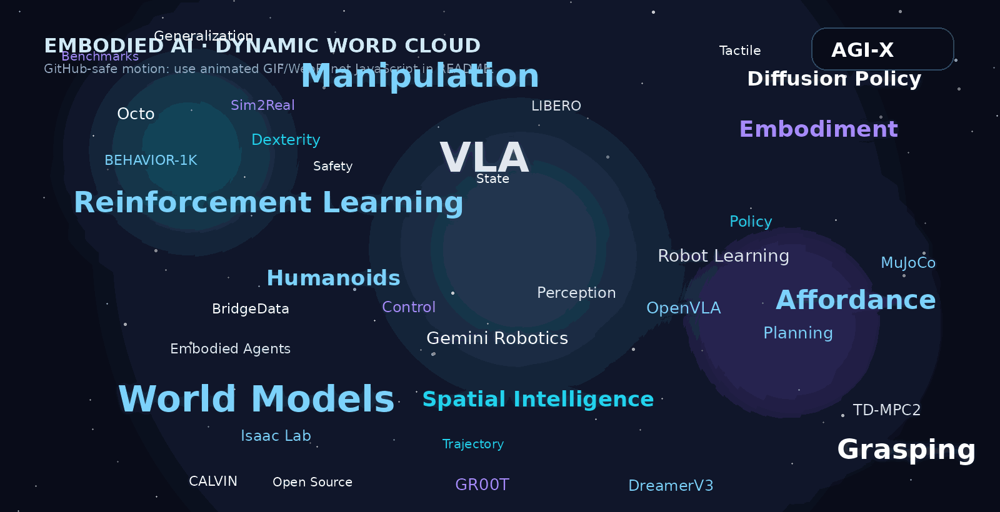

<div align="center">



# Embodied Intelligence Playbook

**A structured atlas for embodied intelligence**  
**roadmaps, ecosystem maps, build paths, benchmarks, toolchains, and reproducible starting points**

[](LICENSE)
[]()
[]()

</div>

---

## What this repository is

**Embodied Intelligence Playbook** is not designed to be another broad link archive.

It is designed as a **research-and-practice atlas** with four priorities:

1. **System stack before resource type**
2. **Judgment before accumulation**
3. **Build path before paper volume**
4. **Ecosystem map before institution name dump**

That means the repository is organized so readers can answer:

- where a topic sits in the embodied stack
- what the classical backbone is
- what changed in 2025-2026
- what is open and reproducible
- what a realistic build path looks like

---

## Top Navigation

### Roadmaps

- [Overview](docs/roadmap/overview.md)
- [Vision-Language-Action](docs/roadmap/vla.md)
- [World Models](docs/roadmap/world_model.md)
- [Reinforcement Learning](docs/roadmap/rl.md)
- [Manipulation](docs/roadmap/manipulation.md)
- [Grasping](docs/roadmap/grasping.md)
- [Affordance Learning](docs/roadmap/affordance.md)

### Maps

- [Academia Map](docs/maps/academia.md)
- [Industry Map](docs/maps/industry.md)

### Resources

- [Benchmarks](docs/resources/benchmarks.md)
- [Datasets](docs/resources/datasets.md)
- [Simulators](docs/resources/simulators.md)
- [Frameworks](docs/resources/frameworks.md)
- [Conferences & Journals](docs/resources/venues.md)

### Build Paths

- [VLA Entry](docs/build_paths/vla_entry.md)
- [World Model](docs/build_paths/world_model.md)
- [Grasping + Affordance](docs/build_paths/grasping_affordance.md)
- [Sim-to-Real](docs/build_paths/sim2real.md)
- [Real Robot](docs/build_paths/real_robot.md)

### Paper Lists

- [By Topic](docs/paper_lists/by_topic/)
- [By Conference](docs/paper_lists/by_conference/)
- [By Journal](docs/paper_lists/by_journal/)

---

## Why this repository is different

Many repositories are useful as paper indexes. This one is trying to be useful as a **decision surface**.

The intended experience is:

- start from the system layer you care about
- compare classical backbone vs frontier signal
- choose a benchmark, simulator, dataset, and toolchain
- follow a concrete build path
- track the institutions and companies shaping that slice of the field

In short:

- **not** a flat resource shelf
- **but** a navigable embodied-AI atlas

---

## Shared Labels

The atlas uses a shared label vocabulary across roadmap tables and build paths:

- `classical`
- `frontier-2025-2026`
- `open-source`
- `benchmark`
- `simulator`
- `industry-system`
- `build-path`
- `beginner-friendly`
- `reproducible`
- `industrial-signal`

These labels are meant to help readers scan the repository as a navigation system, not just as prose.

---

## How to use this repository

### If you are a beginner

1. Read [Overview](docs/roadmap/overview.md)
2. Pick one route: [VLA](docs/roadmap/vla.md), [World Models](docs/roadmap/world_model.md), or [Grasping](docs/roadmap/grasping.md)
3. Follow one execution page under [Build Paths](docs/build_paths/)

### If you want to build a system

1. Start from [Benchmarks](docs/resources/benchmarks.md)
2. Pick the smallest environment that measures your target failure mode
3. Use [Frameworks](docs/resources/frameworks.md) and [Simulators](docs/resources/simulators.md) to choose a stack
4. Use a build path page instead of jumping straight into frontier papers

### If you want to do research

1. Start from the relevant roadmap page
2. Separate `Classical Backbone` from `Frontier Watchlist`
3. Track the relevant nodes in [Academia Map](docs/maps/academia.md) and [Industry Map](docs/maps/industry.md)
4. Use [Conferences & Journals](docs/resources/venues.md) to build your update loop

---

## Recommended starting routes

| Goal | Recommended route |
|---|---|
| open-source VLA entry | [VLA roadmap](docs/roadmap/vla.md) -> [Benchmarks](docs/resources/benchmarks.md) -> [VLA build path](docs/build_paths/vla_entry.md) |
| predictive control and world models | [World Models](docs/roadmap/world_model.md) -> [RL](docs/roadmap/rl.md) -> [World Model build path](docs/build_paths/world_model.md) |
| perception to physical interaction | [Grasping](docs/roadmap/grasping.md) -> [Affordance](docs/roadmap/affordance.md) -> [Grasping + Affordance build path](docs/build_paths/grasping_affordance.md) |
| low-cost real robot practice | [Manipulation](docs/roadmap/manipulation.md) -> [Datasets](docs/resources/datasets.md) -> [Real Robot build path](docs/build_paths/real_robot.md) |
| simulation to deployment | [Simulators](docs/resources/simulators.md) -> [Frameworks](docs/resources/frameworks.md) -> [Sim-to-Real build path](docs/build_paths/sim2real.md) |

---

## Visual field

<p align="center">
  
</p>

<p align="center">
  
</p>
---

## Repository structure

```text
embodied-intelligence-playbook/
+-- README.md
+-- assets/
|   +-- figures/
+-- docs/
    +-- roadmap/
    +-- maps/
    +-- resources/
    +-- build_paths/
    +-- paper_lists/
    +-- templates/
```

### Directory intent

- `roadmap/`: topic pages organized by system stack
- `maps/`: academia and industry ecosystem maps
- `resources/`: benchmarks, datasets, frameworks, simulators, venues
- `build_paths/`: execution-first reading and implementation paths
- `paper_lists/`: index layers by topic, venue, and journal
- `templates/`: contributor templates to keep the atlas coherent

---

## Design rules

This repository grows under a few fixed rules:

- **clarity over clutter**
- **system placement over trend-chasing**
- **official project pages over secondary summaries**
- **reproducible paths over broad name-dropping**
- **guide pages before list pages**

---

## Contributing

This project welcomes roadmap upgrades, benchmark curation, system matrices, build-path refinements, reproduction notes, and ecosystem mapping.

Start with [CONTRIBUTING.md](CONTRIBUTING.md), the templates in [docs/templates](docs/templates/), and the maintenance cadence in [docs/maintenance.md](docs/maintenance.md).

---

## License

This project is released under the [MIT License](LICENSE).
