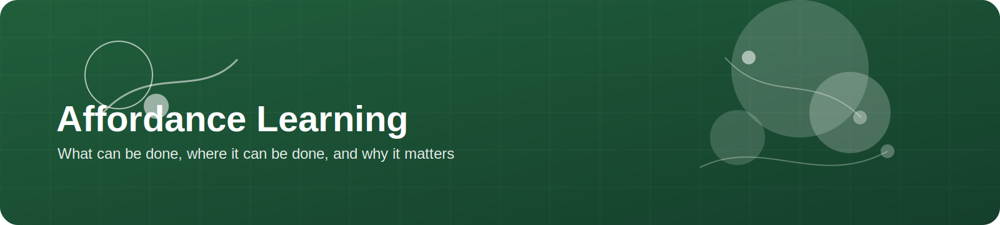
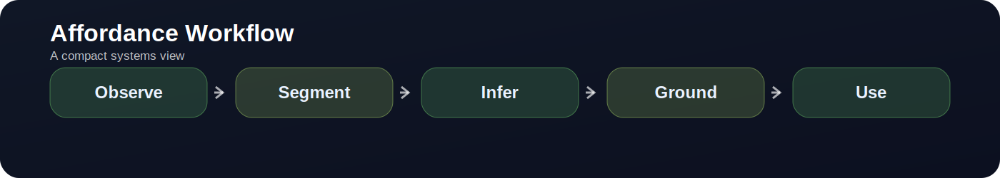

  

# Affordance Learning

> **Affordance is where semantics becomes executable.** It tells a robot not just what an object is, but what can be done with it, where, and for which task.

  

---

## What this topic is really about

Affordance learning asks:

- what actions are possible on an object?
- where are the functional regions for those actions?
- how does the answer change with the task?
- how do semantic labels become executable robot constraints?

---

## Why it matters

Affordance is often the missing middle layer between perception and control. Without it, systems may detect objects correctly but still choose poor contact regions or irrelevant actions.

---

## Useful datasets, papers, and tools

| Resource | Why it matters | Links |
|---|---|---|
| AffordanceNet | classic detection + affordance benchmark | [paper](https://arxiv.org/abs/1709.07326) |
| Where2Act | interaction-centric actionability for articulated objects | [project](https://cs.stanford.edu/~kaichun/where2act/) |
| PartNet-Mobility | articulated-object structure and mobility resource | [project](https://sapien.ucsd.edu/partnet-mobility) |
| SAPIEN | simulation engine heavily used in articulated-object and affordance work | [project](https://sapien.ucsd.edu/) |
| GAPartNet | part-level segmentation / grasp / articulation entry point | [project](https://pku-epic.github.io/GAPartNet/) |

---

## Practical research directions

### Dense point-wise affordance maps
Good for grasping, pressing, cutting, poking, lifting.

### Part-aware affordance reasoning
Useful when articulated mechanisms and object structure matter.

### Language-conditioned affordance
Useful when “what matters” depends on task phrasing.

### Retrieval-based affordance transfer
Especially useful when labeled affordance data is scarce.

---

## What to inspect in an affordance paper

- whether labels are part-based, pixel-based, point-wise, or language-conditioned
- whether multiple affordances can overlap on one object
- whether the final output can be turned into a robot action without manual glue code
- whether the paper studies transfer across object categories

---

## Closing Thought

Affordance learning becomes truly valuable when it does not stop at annotation quality, but continues all the way to **action selection and execution geometry**.
