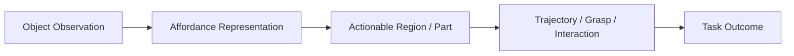

  

# Affordance Learning

> **Affordance is the language of possibility between perception and action.**

  

---

## What this topic is really about

Affordance learning studies what actions are possible on an object, **where** those actions should be applied, and sometimes **how** they should be executed.

This topic matters because it converts perception into something actionable:

- not just “this is a mug”
- but “this region can be grasped”
- not just “this is a drawer”
- but “this handle affords pulling”

Affordance is often the missing bridge between semantic understanding and executable manipulation.

---

## Research map

---

## Main problem families

| Problem family | Why it matters |
|---|---|
| 2D affordance detection | useful for RGB or RGB-D interactive perception |
| 3D affordance grounding | better aligns with geometry-aware robotic action |
| articulated-object interaction | drawers, doors, handles, lids, knobs require function-aware reasoning |
| cross-category affordance transfer | robots must act on unseen objects that share functionality, not appearance |
| affordance + control coupling | predicting where to act is not enough; the system must still execute the action |

---

## Must-read papers and projects

| Work | Venue / Year | Why it matters | Links |
|---|---|---|---|
| AffordanceNet: An End-to-End Deep Learning Approach for Object Affordance Detection | ICRA 2018 | Classic RGB affordance baseline; good historical starting point | [Paper](https://arxiv.org/abs/1709.07326) · [Code](https://github.com/nqanh/affordance-net) |
| Where2Act: From Pixels to Actions for Articulated 3D Objects | 2021 | Very influential “from visual region to action” formulation for articulated objects | [Paper](https://arxiv.org/abs/2101.02692) · [Code](https://github.com/daerduoCarey/where2act) |
| VAT-Mart: Learning Visual Action Trajectory Proposals for 3D Articulated Objects | ICLR 2022 | Extends affordance into actionable trajectory proposals for articulated interaction | [Project](https://hyperplane-lab.github.io/vat-mart/) |
| 3D-AffordanceNet: A Benchmark for Visual Object Affordance Understanding | CVPR 2021 | Canonical 3D affordance benchmark for point-cloud-based work | [Project](https://andlollipopde.github.io/3D-AffordanceNet/) · [Paper](https://arxiv.org/abs/2103.16397) · [Code](https://github.com/Gorilla-Lab-SCUT/AffordanceNet) |
| GAPartNet: Cross-Category Domain-Generalizable Object Perception and Manipulation via Generalizable and Actionable Parts | CVPR 2023 Highlight | Strong part-centric view that bridges perception and manipulation | [Project](https://pku-epic.github.io/GAPartNet/) · [Code](https://github.com/PKU-EPIC/GAPartNet) |
| PartManip: Learning Cross-Category Generalizable Part Manipulation Policy from Point Cloud Observations | CVPR 2023 | Important if you care about manipulation on articulated parts from point clouds | [Code](https://github.com/PKU-EPIC/PartManip) |
| AdaAfford: Learning to Adapt Manipulation Affordance for 3D Articulated Objects via Few-shot Interactions | 2021 | Useful for thinking about adaptation and test-time interaction | [Project](https://hyperplane-lab.github.io/AdaAfford) · [Code](https://github.com/wangyian-me/AdaAffordCode) |
| Robo-ABC: Affordance Generalization Beyond Categories via Semantic Correspondence | 2024 | Good example of retrieval / correspondence-style affordance transfer | [Paper](https://arxiv.org/html/2401.07487v1) |

---

## Datasets and assets that matter

| Resource | Why it matters | Links |
|---|---|---|
| PartNet-Mobility | articulated objects with motion annotations; foundational for articulated affordance work | [Browse](https://sapien.ucsd.edu/browse) |
| 3D-AffordanceNet | standard 3D benchmark for affordance understanding | [Project](https://andlollipopde.github.io/3D-AffordanceNet/) |
| GAPartNet | part-centric dataset for cross-category actionable parts | [Project](https://pku-epic.github.io/GAPartNet/) |
| SAPIEN assets | useful for articulated-object simulation and perception pipelines | [SAPIEN](https://sapien.ucsd.edu/) |

---

## Open-source project stack

| Project | Best use case | Links |
|---|---|---|
| AffordanceNet | 2D RGB affordance baseline | [Code](https://github.com/nqanh/affordance-net) |
| Where2Act | articulated-object actionable-region prediction | [Code](https://github.com/daerduoCarey/where2act) |
| VAT-Mart | region + trajectory proposal on articulated objects | [Project](https://hyperplane-lab.github.io/vat-mart/) |
| 3D-AffordanceNet codebase | baseline implementations on the canonical 3D benchmark | [Code](https://github.com/Gorilla-Lab-SCUT/AffordanceNet) |
| GAPartNet | part-centric perception and manipulation bridge | [Code](https://github.com/PKU-EPIC/GAPartNet) |
| PartManip | articulated-part manipulation from point clouds | [Code](https://github.com/PKU-EPIC/PartManip) |

---

## How to read affordance papers

Ask these questions:

1. **What is the affordance representation?**  
   Pixel mask? pointwise label? part category? heatmap? prototype? contact point?

2. **What supervision is used?**  
   Dense labels? interaction rollouts? pseudo-labels? retrieval memory? weak supervision?

3. **Does the paper predict only “where”, or also “how”?**  
   Many systems stop before trajectory or grasp execution.

4. **How does it generalize?**  
   New instances? new categories? new viewpoints? real sensor data?

5. **Is affordance tied to action?**  
   Good affordance work should eventually help manipulation, not only segmentation scores.

---

## Common failure modes

- affordance regions that are semantically plausible but not executable
- overfitting to category appearance instead of functional similarity
- dense labels that ignore how the robot will actually approach the object
- success on static benchmarks without gains in downstream manipulation
- articulated-object assumptions that break on cluttered real scenes

---

## Build-first project ideas

### Beginner project
Take **3D-AffordanceNet** and benchmark a point-cloud affordance model on one affordance family.

### Intermediate project
Use **Where2Act** or **VAT-Mart** and compare:
- actionable region quality
- trajectory quality
- transfer to new articulated objects

### Advanced project
Combine:
- an affordance predictor,
- a grasp generator,
- and a task-aware reranker.

Then study how much affordance helps real downstream success.

---

## Related paper lists

- [Topic paper list — Affordance](../paper_lists/by_topic/affordance.md)
- [CVPR selections](../paper_lists/by_conference/cvpr.md)
- [ICRA selections](../paper_lists/by_conference/icra.md)
- [ICLR selections](../paper_lists/by_conference/iclr.md)

---

## Closing thought

Affordance learning becomes powerful only when it stops being descriptive and starts becoming **operationally useful** for action.
