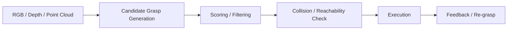

  

# Grasping

> **A grasp is never just a pose. It is a prediction about stability, geometry, and the next task.**

  

---

## What this topic is really about

Grasping asks how a robot should choose and execute **stable, task-relevant contact** on objects under:

- partial observation
- clutter
- novel shapes
- sensor noise
- downstream task constraints

It is the most direct place where **geometry, uncertainty, and action feasibility** meet.

---

## Research map

---

## Main technical routes

### 1. Analytic grasp synthesis
Traditional route based on geometry, force closure, and hand/object contact models.

### 2. Candidate generation + learned scoring
Generate many grasps, then rank them with learned models.

### 3. Direct 6-DoF grasp prediction
Predict grasps directly from point clouds or depth scenes.

### 4. Task-oriented grasping
Pick grasps that help the next task, not just immediate pickup stability.

### 5. Reactive / temporal grasping
Handle dynamic scenes and re-evaluate while the robot acts.

---

## Must-read papers and projects

| Work | Venue / Year | Why it matters | Links |
|---|---|---|---|
| GPD: Grasp Pose Detection in Point Clouds | 2017 | Classic point-cloud grasp detection pipeline and strong baseline mentality | [Paper](https://arxiv.org/abs/1706.09911) · [Code](https://github.com/atenpas/gpd) |
| GraspNet-1Billion: A Large-Scale Benchmark for General Object Grasping | CVPR 2020 | The benchmark that changed the scale and realism of 6-DoF grasp evaluation | [Project](https://graspnet.net/) · [Paper](https://openaccess.thecvf.com/content_CVPR_2020/papers/Fang_GraspNet-1Billion_A_Large-Scale_Benchmark_for_General_Object_Grasping_CVPR_2020_paper.pdf) |
| Contact-GraspNet: Efficient 6-DoF Grasp Generation in Cluttered Scenes | ICRA 2021 | Widely used direct 6-DoF grasp generation model from raw scene point clouds | [Paper](https://research.nvidia.com/publication/2021-03_contact-graspnet-efficient-6-dof-grasp-generation-cluttered-scenes) · [Code](https://github.com/NVlabs/contact_graspnet) |
| Graspness Discovery in Clutters for Fast and Accurate Grasp Detection | ICCV 2021 | Important bridge between scene understanding and dense grasp selection | [Project / Paper Links](https://graspnet.net/publications.html) |
| AnyGrasp: Robust and Efficient Grasp Perception in Spatial and Temporal Domains | T-RO 2023 | Strong practical library for dense, robust, temporally smooth grasping | [Project](https://graspnet.net/anygrasp.html) · [Paper & Library](https://graspnet.net/publications.html) |
| SuctionNet-1Billion | RA-L 2021 | Useful if suction grasping is relevant to industrial manipulation | [Project & Paper Links](https://graspnet.net/publications.html) |

---

## Benchmark and dataset map

| Resource | Why it matters | Links |
|---|---|---|
| GraspNet-1Billion | standard large-scale 6-DoF grasp benchmark | [Project](https://graspnet.net/) |
| SuctionNet-1Billion | suction-specific benchmark for industrial setups | [Publications page](https://graspnet.net/publications.html) |
| TransCG | transparent-object depth completion and grasping | [Publications page](https://graspnet.net/publications.html) |
| YCB | standard object set often used in grasping/manipulation pipelines | [YCB Benchmarks](http://ycb-benchmarks.s3-website-us-east-1.amazonaws.com/) |

---

## Practical open-source stack

| Project | Best use case | Links |
|---|---|---|
| GPD | classic baseline, ROS-style integration, simpler grasp-candidate workflow | [Code](https://github.com/atenpas/gpd) |
| Contact-GraspNet | direct 6-DoF grasp generation from scene point clouds | [Code](https://github.com/NVlabs/contact_graspnet) |
| AnyGrasp | practical deployment-oriented dense grasp library | [Project](https://graspnet.net/anygrasp.html) |
| GraspNet ecosystem | benchmark, evaluation, dataset, and libraries in one place | [Project](https://graspnet.net/) |

---

## What to look for in grasping papers

- **input modality**: depth, RGB-D, point cloud, segmentation, tactile feedback
- **grasp representation**: contact pairs, 6-DoF pose, suction center, dense heatmap
- **evaluation mode**: analytic metric, simulation, real robot, clutter, dynamics
- **downstream task link**: is the grasp just stable, or useful for what comes next?
- **runtime**: can the method operate fast enough for closed-loop deployment?

---

## Common failure modes

- grasps that look stable but are unreachable
- grasps that work in isolation but fail in clutter
- grasp ranking that ignores object mass distribution or task intent
- models that overfit to depth cleanliness or camera pose
- evaluation protocols that do not match deployment conditions

---

## Good first projects

### Beginner project
Run **GPD** and **Contact-GraspNet** on the same point-cloud scenes and compare:
- density of proposals
- collision quality
- runtime
- grasp diversity

### Intermediate project
Take **AnyGrasp** or **GraspNet** grasps and add a **task-aware reranking module** based on object affordance or target pose.

### Advanced project
Study how grasp generation should change when:
- the object is articulated,
- the object is deformable,
- the next task imposes a pose or interaction constraint.

---

## Related paper lists

- [Topic paper list — Grasping](../paper_lists/by_topic/grasping.md)
- [CVPR selections](../paper_lists/by_conference/cvpr.md)
- [ICCV selections](../paper_lists/by_conference/iccv.md)
- [ICRA selections](../paper_lists/by_conference/icra.md)
- [RA-L selections](../paper_lists/by_journal/ral.md)
- [T-RO selections](../paper_lists/by_journal/tro.md)

---

## Closing thought

A grasp is valuable only when it is not merely possible, but **deployable, stable, and useful for the next stage of the task**.
