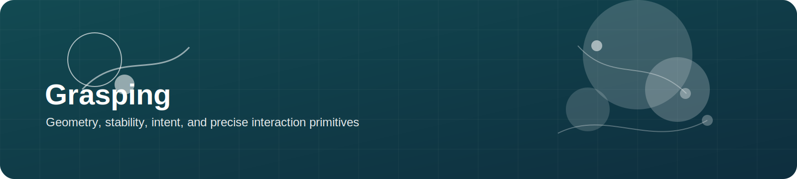
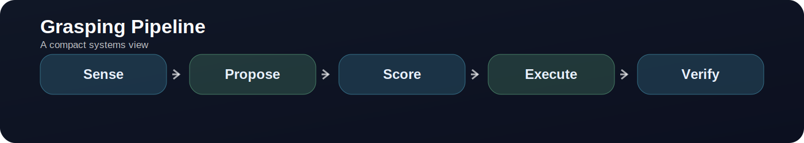

  

# Grasping

> **Grasping is not only about contact.** It is about choosing a contact that makes the next part of the task possible.

  

---

## What this topic is really about

A useful grasping system must answer three questions together:

1. **Where can I contact the object?**
2. **Will that grasp be stable?**
3. **Is it the right grasp for the downstream task?**

That is why modern grasping is not only geometry estimation. It is also task conditioning, scene reasoning, and execution monitoring.

---

## Canonical resources

| Resource | Why it matters | Links |
|---|---|---|
| GraspNet | large-scale benchmark and baseline ecosystem | [project](https://graspnet.net/) |
| Contact-GraspNet | influential 6-DoF grasp estimation on point clouds | [project](https://contact-graspnet.github.io/) · [code](https://github.com/NVlabs/contact_graspnet) |
| AnyGrasp | practical real-time grasp detection system | [project](https://graspnet.net/anygrasp.html) |
| GPD | classic candidate-generation + scoring baseline | [code](https://github.com/atenpas/gpd) |

---

## Where grasping research is moving

- from isolated grasp stability to **task-oriented grasping**
- from single-object clean scenes to **cluttered and partial-observation** settings
- from RGB-D only to **point cloud + semantics + language**
- from offline ranking to **closed-loop grasp correction**

---

## Recommended reading path

### Start with the benchmark
Read GraspNet and understand how data, metrics, and candidate grasps are represented.

### Then compare two paradigms
- proposal-based analytical / geometric methods
- learned point-cloud or multimodal methods

### Then add task awareness
Ask how the grasp changes if the downstream task is:
- lift
- place
- pour
- cut
- handover

---

## Practical implementation notes

- Pair grasp generation with object segmentation or affordance priors whenever possible.
- Always visualize grasps in the scene frame before sending them to a controller.
- For task-oriented work, store both grasp score and task score.
- Evaluate not just contact success but also downstream task completion.

---

## Closing Thought

The strongest grasp is not the one that merely holds. It is the one that **holds in the service of a longer action**.
