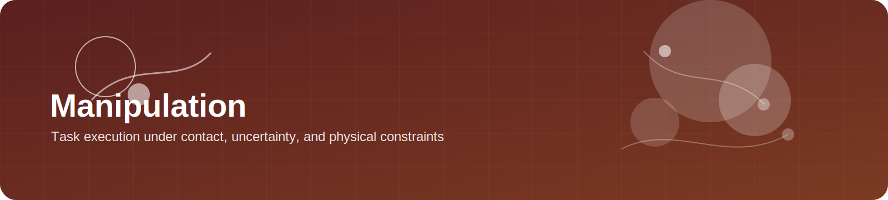
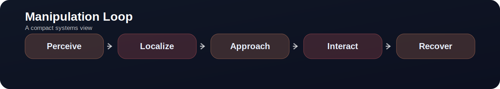

  

# Manipulation

> **Manipulation is where intelligence leaves description and enters consequence.**

  

---

## Topic Mood

Manipulation is the practical theater of embodied intelligence.  
It is where planning meets contact, perception meets timing, and beautiful abstractions meet stubborn physics.

A manipulation system is rarely judged by how elegant its model looks in isolation.  
It is judged by whether tasks actually get finished:

- pick and place
- open and close
- insert, align, push, pull
- organize clutter
- use tools
- recover after deviation

That is why manipulation is both deeply applied and conceptually rich.

---

## What is this topic?

Manipulation studies how robots interact with objects to produce purposeful state change.

This sounds broad because it is broad. In practice, manipulation sits on top of several coupled problems:

- scene understanding
- object localization
- reachability and motion generation
- contact management
- grasp selection
- task sequencing
- feedback and recovery

A manipulation pipeline becomes interesting when these components cannot be treated independently anymore.

---

## Why it matters

Manipulation matters because it is one of the clearest tests of whether an embodied system can do more than react.

A strong manipulation system must show:

- task completion
- robustness under clutter
- tolerance to perception noise
- physical competence under contact
- ability to recover when execution drifts

It is also one of the best arenas for unifying perception, planning, control, affordance, and world modeling.

---

## The Core Structure of Manipulation

A useful mental picture is:

| Stage | Main question |
|---|---|
| perceive | what matters in the scene right now? |
| localize | where are the relevant objects, parts, and constraints? |
| approach | how should the robot enter the interaction? |
| interact | what force, pose, timing, or sequence changes the object state? |
| recover | what happens if the nominal execution fails? |

Many systems are strong on the first three and weak on the last two.

---

## Typical Technical Routes

### Route A — planning-heavy manipulation
Use explicit models, motion planning, constraints, or symbolic structure to drive execution.

**Strengths**
- interpretable
- compositional
- often reliable when models are correct

**Weaknesses**
- brittle to uncertainty
- hard to scale to cluttered or ambiguous scenes

### Route B — imitation-driven manipulation
Learn policies from demonstrations.

**Strengths**
- direct path from examples to behavior
- practical for many short-horizon tasks
- useful when specifying reward is difficult

**Weaknesses**
- covariate shift
- limited recovery unless demonstrations include it
- may imitate style rather than intention

### Route C — reinforcement learning for interaction
Optimize behavior through trial and feedback.

**Strengths**
- useful for contact-rich or non-trivial strategies
- can discover robust behaviors

**Weaknesses**
- sample inefficiency
- reward design burden
- sim-to-real gap can dominate

### Route D — hybrid systems
Combine learned perception or policy modules with analytical planning or control.

**Strengths**
- often the most practical route
- allows each component to do what it is best at

**Weaknesses**
- interfaces become the main engineering challenge

---

## What Makes Manipulation Hard

### 1. Contact is not a small detail
The moment the robot touches the object, uncertainty spikes.

### 2. Success is sequential
A task may fail because of an early alignment mistake even if the final action looks correct.

### 3. The scene is not static
Objects move, occlude each other, and change task affordances.

### 4. Recovery is not optional
A manipulation system without recovery is often a demo, not yet a tool.

---

## A Useful Taxonomy

You can classify manipulation tasks by the kind of physical reasoning they demand.

| Task family | Main difficulty |
|---|---|
| pick-and-place | grasp quality and placement precision |
| articulated object manipulation | hidden kinematic or force constraints |
| contact-rich insertion | alignment tolerance and force-sensitive control |
| clutter manipulation | interaction coupling between multiple objects |
| tool use | delayed consequence and relational reasoning |
| long-horizon household tasks | sequencing, memory, and error accumulation |

This taxonomy is often more helpful than grouping by benchmark name.

---

## Practical Failure Modes

### Perception-led failure
The system never identified the relevant handle, edge, or free space.

### Geometry-led failure
The plan exists, but the approach trajectory or gripper pose is poor.

### Contact-led failure
The interaction starts, but force, friction, or compliance breaks the behavior.

### Sequencing-led failure
Each short step is locally sensible, but the full task does not compose.

### Recovery-led failure
After the first deviation, the system continues as though nothing happened.

---

## Build-First Project Ideas

### Beginner project
Implement a clean pick-and-place pipeline in simulation and compare open-loop versus closed-loop execution.

### Intermediate project
Add explicit recovery logic to a manipulation task and measure how much end success depends on recovery rather than nominal accuracy.

### Advanced project
Compare a pure policy approach with a hybrid system that combines:
- learned perception
- grasping or affordance prior
- motion planning
- reactive correction

---

## Reading Strategy

When reading manipulation papers, ask:

1. Where does task structure come from?
2. How much of the system is open loop?
3. Where is recovery handled?
4. What kind of contact is central?
5. Is the benchmark exposing the hard part or hiding it?

These questions often separate genuine progress from polished demonstration.

---

## Representative Work Clusters to Curate Later

- imitation learning for manipulation
- contact-rich manipulation
- long-horizon task execution
- articulated object interaction
- language-conditioned manipulation
- hybrid perception–planning systems

---

## Closing Thought

Manipulation is not just about moving objects.  
It is about making intention survive contact.
