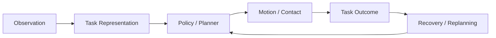

  

# Manipulation

> **Manipulation is where perception becomes commitment.**

  

---

## What this topic is really about

Manipulation studies how robots interact with objects to complete tasks such as:

- pick and place
- opening drawers and doors
- tool use
- insertion
- rearrangement
- long-horizon multi-stage tabletop or mobile manipulation

It is a core embodied-AI topic because it exposes the full chain from **visual understanding → action selection → contact → recovery**.

---

## Research map

---

## Key problem families

| Problem family | Why it is hard |
|---|---|
| contact-rich execution | small pose errors can cause total task failure |
| long-horizon structure | many tasks require staging, memory, and recovery |
| clutter and occlusion | scene understanding is partial and changes during execution |
| task generalization | policies must work across objects, layouts, and language variations |
| embodiment mismatch | data collection, training, and deployment often happen on different robots |

---

## Main technical routes

### 1. Behavior cloning and imitation learning
Fastest route to strong practical baselines when good demonstrations are available.

### 2. Diffusion and sequence policies
Useful for multimodal or temporally coherent action prediction.

### 3. 3D action-centric policies
Represent observations and actions in voxel/point/3D spaces for stronger geometric priors.

### 4. Language-conditioned multi-task learning
Useful when task identity changes often or instructions must generalize.

### 5. Teleoperation-centered real-data pipelines
A very practical route for real-world manipulation systems.

---

## Must-read papers

| Paper | Venue / Year | Why it matters | Links |
|---|---|---|---|
| PerAct: A Multi-Task Transformer for Robotic Manipulation | CoRL 2022 | A very influential 3D language-conditioned manipulation baseline | [Project](https://peract.github.io/) · [Code](https://github.com/peract/peract) |
| Diffusion Policy: Visuomotor Policy Learning via Action Diffusion | RSS 2023 | One of the most practical and widely adopted modern policy baselines | [Project](https://diffusion-policy.cs.columbia.edu/) · [Code](https://github.com/real-stanford/diffusion_policy) |
| Learning Fine-Grained Bimanual Manipulation with Low-Cost Hardware (ACT / ALOHA) | RSS 2023 | Important for fine-grained real-world imitation learning with action chunks | [Project](https://tonyzhaozh.github.io/aloha/) · [Code](https://github.com/tonyzhaozh/act) |
| Mobile ALOHA: Learning Bimanual Mobile Manipulation with Low-Cost Whole-Body Teleoperation | CoRL 2024 | A practical bridge from tabletop manipulation to mobile, whole-body tasks | [Project](https://mobile-aloha.github.io/) · [Paper](https://arxiv.org/abs/2401.02117) |
| VIMA: General Robot Manipulation with Multimodal Prompts | ICML 2023 | Important for prompt-centric and generalization-oriented manipulation research | [Project](https://vimalabs.github.io/) · [Code](https://github.com/vimalabs/vima) |
| OpenVLA: An Open-Source Vision-Language-Action Model | CoRL 2024 | Useful as a modern open VLA manipulation stack | [Project](https://openvla.github.io/) · [Code](https://github.com/openvla/openvla) |

---

## Benchmarks and environments

| Benchmark / Env | What it is good for | Links |
|---|---|---|
| RLBench | diverse, structured, multi-task simulated manipulation | [Website](https://sites.google.com/view/rlbench) · [Code](https://github.com/stepjam/RLBench) |
| CALVIN | long-horizon language-conditioned manipulation | [Project](https://calvin.cs.uni-freiburg.de/) · [Code](https://github.com/mees/calvin) |
| LIBERO | transfer and lifelong robot learning evaluation | [Project](https://libero-project.github.io/main.html) · [Code](https://github.com/Lifelong-Robot-Learning/LIBERO) |
| ManiSkill | scalable, open-source manipulation training and data generation | [Website](https://www.maniskill.ai/) · [Code](https://github.com/haosulab/maniskill) |
| FurnitureBench | real-world long-horizon assembly benchmark | [Project](https://clvrai.github.io/furniture-bench/) |
| BridgeData V2 | accessible real-robot data for scalable manipulation | [Project](https://rail-berkeley.github.io/bridgedata/) · [Code](https://github.com/rail-berkeley/bridge_data_v2) |

---

## Open-source stacks worth knowing

| Stack | Why you would choose it | Links |
|---|---|---|
| robomimic | standardized offline imitation-learning baselines and datasets | [Project](https://robomimic.github.io/) · [Code](https://github.com/ARISE-Initiative/robomimic) |
| LeRobot | practical model/dataset/deployment ecosystem | [Hub](https://huggingface.co/lerobot) · [Code](https://github.com/huggingface/lerobot) |
| ACT + ALOHA | strong low-cost real-robot manipulation starting point | [Policy code](https://github.com/tonyzhaozh/act) · [Hardware](https://github.com/tonyzhaozh/aloha) |
| Diffusion Policy | strong baseline for state and vision-based imitation learning | [Project](https://diffusion-policy.cs.columbia.edu/) · [Code](https://github.com/real-stanford/diffusion_policy) |
| PerAct | good if you care about 3D language-conditioned manipulation | [Project](https://peract.github.io/) · [Code](https://github.com/peract/peract) |

---

## What strong manipulation papers usually get right

- they evaluate in **closed loop**
- they explain the **action interface**
- they choose a benchmark that matches the claim
- they analyze failure under drift, not only on nominal trajectories
- they make clear whether the method depends on teleoperation, simulation, or large-scale pretraining

---

## Common failure modes

- action distribution drift over long horizons
- contact-sensitive tasks failing despite good visual grounding
- low success under small viewpoint or object-pose changes
- policies that are impressive offline but brittle online
- evaluation setups that hide reset, recovery, or planning burdens

---

## Build-first project ideas

### A good beginner stack
- benchmark: RLBench or CALVIN
- policy: Diffusion Policy or ACT
- evaluation: task success in closed loop

### A good research stack
- benchmark: LIBERO or FurnitureBench
- policy: PerAct / OpenVLA / ACT / Diffusion Policy
- focus: transfer, recovery, or action representation

### A good practical stack
- data: BridgeData V2 or your own ALOHA-style demos
- framework: LeRobot or robomimic
- task: 2–5 tasks with carefully chosen evaluation metrics

---

## Related paper lists

- [Topic paper list — Manipulation](../paper_lists/by_topic/manipulation.md)
- [RSS selections](../paper_lists/by_conference/rss.md)
- [CoRL selections](../paper_lists/by_conference/corl.md)
- [ICML selections](../paper_lists/by_conference/icml.md)

---

## Closing thought

Manipulation is not won by having the biggest model.  
It is won by choosing the right **task interface, benchmark, and recovery strategy** for real interaction.
