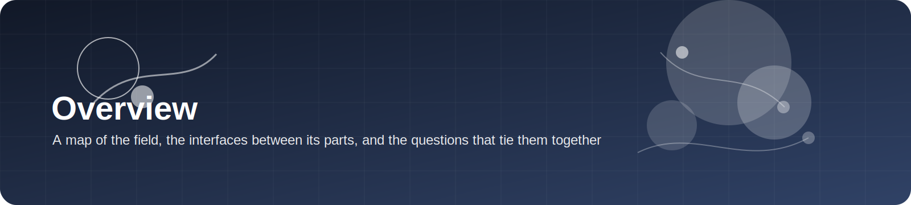
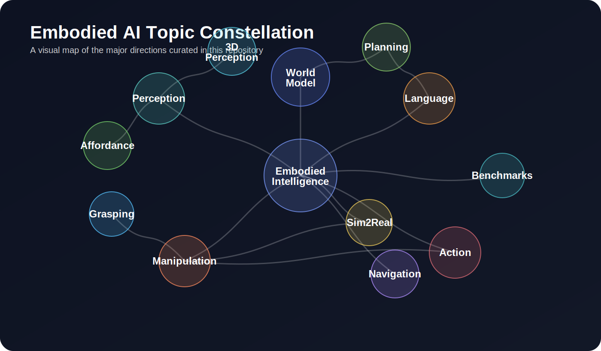
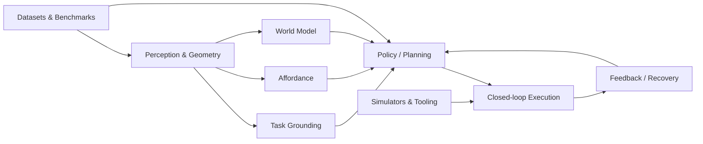

  

# Overview

> **Embodied intelligence is not one problem. It is a stack of coupled problems** — representation, action, memory, interaction, embodiment, and transfer.

  

---

## The field at a glance

Embodied AI sits at the intersection of:

- **perception**, because the agent must read a changing scene
- **language**, because goals are often specified abstractly
- **control**, because behavior must be physically executed
- **world modeling**, because action requires prediction
- **interaction**, because objects respond to contact and force
- **generalization**, because every new scene or embodiment changes the problem

A useful way to think about the field is to separate three layers:

| Layer | Main question | Typical outputs |
|---|---|---|
| perception & representation | what is in the scene and what matters? | object state, 3D geometry, task-relevant features |
| decision & prediction | what should happen next and why? | plans, latent rollouts, subgoals, policies |
| execution & adaptation | how do we make it work in the loop? | control actions, corrections, recoveries |

---

## Field map

---

## Five core topic families in this repository

### 1. Vision-Language-Action
Focuses on how vision and language become executable motor behavior.

Open the page: [Vision-Language-Action](vla.md)

### 2. World Models
Focuses on predicting latent or geometric future states so that a robot can imagine before acting.

Open the page: [World Models](world_model.md)

### 3. Manipulation
Focuses on task execution under contact, uncertainty, clutter, and long-horizon structure.

Open the page: [Manipulation](manipulation.md)

### 4. Grasping
Focuses on stable, task-relevant contact generation and grasp selection in cluttered scenes.

Open the page: [Grasping](grasping.md)

### 5. Affordance Learning
Focuses on where and how an object can be acted upon, often bridging perception and action.

Open the page: [Affordance Learning](affordance.md)

---

## Cross-cutting themes

These themes appear again and again across subfields:

| Theme | Why it matters |
|---|---|
| data interface | robot data comes in many formats, embodiments, and conventions |
| action representation | joints, end-effector deltas, chunks, tokens, trajectories, and diffusion samples all behave differently |
| 3D structure | many embodied tasks become easier once the system reasons over geometry rather than only pixels |
| long-horizon credit assignment | even simple instructions can require memory, recovery, and multi-stage execution |
| embodiment transfer | policies that work on one robot often fail silently on another if the action/state interface is not unified |
| sim-to-real | simulation is useful only when the chosen benchmark and control abstractions preserve the right bottlenecks |

---

## Canonical datasets, simulators, and frameworks

### Datasets to know early
- [Open X-Embodiment](../resources/datasets.md#open-x-embodiment)
- [BridgeData V2](../resources/datasets.md#bridgedata-v2)
- [CALVIN](../resources/datasets.md#calvin)
- [LIBERO](../resources/datasets.md#libero)
- [GraspNet-1Billion](../resources/datasets.md#graspnet-1billion)
- [PartNet-Mobility](../resources/datasets.md#partnet-mobility)
- [3D-AffordanceNet](../resources/datasets.md#3d-affordancenet)

### Simulators to know early
- [MuJoCo](../resources/simulators.md#mujoco)
- [Isaac Lab](../resources/simulators.md#isaac-lab)
- [ManiSkill](../resources/simulators.md#maniskill)
- [RLBench](../resources/simulators.md#rlbench)
- [Habitat 3.0](../resources/simulators.md#habitat-30)
- [SAPIEN](../resources/simulators.md#sapien)

### Frameworks to know early
- [LeRobot](../resources/frameworks.md#lerobot)
- [robomimic](../resources/frameworks.md#robomimic)
- [OpenVLA](../resources/frameworks.md#openvla)
- [Octo](../resources/frameworks.md#octo)
- [TD-MPC2](../resources/frameworks.md#td-mpc2)
- [MuJoCo Playground](../resources/frameworks.md#mujoco-playground)

---

## Major venues worth tracking

### Conferences
- [ICRA](../paper_lists/by_conference/icra.md)
- [RSS](../paper_lists/by_conference/rss.md)
- [CoRL](../paper_lists/by_conference/corl.md)
- [CVPR](../paper_lists/by_conference/cvpr.md)
- [ICCV](../paper_lists/by_conference/iccv.md)
- [ICLR](../paper_lists/by_conference/iclr.md)
- [ICML](../paper_lists/by_conference/icml.md)

### Journals
- [RA-L](../paper_lists/by_journal/ral.md)
- [T-RO](../paper_lists/by_journal/tro.md)

---

## Three practical entry paths

### A. New researcher
1. Read this overview.
2. Pick one roadmap page.
3. Follow the “must-read papers” table there.
4. Use the resources pages to choose one benchmark and one framework.
5. Reproduce one open-source baseline.

### B. Engineer building a system
1. Start from **manipulation** or **grasping**.
2. Decide your action interface and evaluation benchmark first.
3. Use **affordance** only when task-specific interaction regions matter.
4. Add **world models** only when planning or data efficiency is the actual bottleneck.

### C. Researcher interested in foundation models
1. Start from **VLA**.
2. Read **Open X / Octo / OpenVLA / RT-2**.
3. Compare action interfaces and evaluation setups.
4. Bring in **world models** when you need memory, prediction, or embodiment-agnostic planning.

---

## A note on reading papers in this area

Read every paper through four questions:

1. **What information enters the system?**  
   RGB? RGB-D? point cloud? proprioception? language? action history?

2. **What is the action interface?**  
   Joint commands? end-effector deltas? action chunks? tokenized actions? trajectories?

3. **What benchmark actually proves the claim?**  
   Offline prediction is not the same as closed-loop execution.

4. **Where does the method fail first?**  
   Contact? recovery? long horizon? embodiment transfer? visual variation?

These four questions make the literature dramatically easier to navigate.

---

## Closing thought

Embodied AI becomes clearer when you stop asking “which topic is hottest?” and start asking:

> **Which abstraction makes action more reliable under physical uncertainty?**

That is the organizing principle behind this repository.
