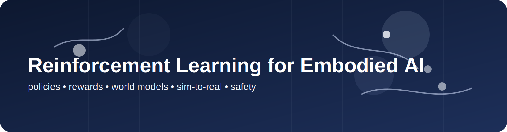
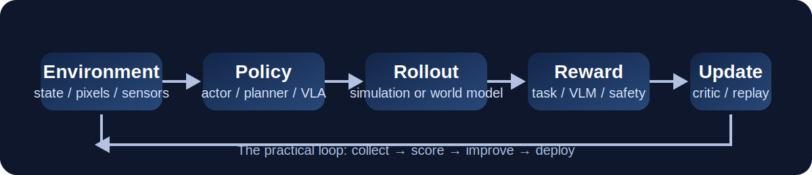

  

# Reinforcement Learning

> **Reinforcement learning is the discipline of improvement under consequence.** In embodied AI, the real question is where that improvement should happen and what signal pays for it.

  

---

## In-page Navigation

- [Topic Thesis](#topic-thesis)
- [Why This Topic Matters](#why-this-topic-matters)
- [Problem Decomposition](#problem-decomposition)
- [Core Technical Routes](#core-technical-routes)
- [Classical Backbone](#classical-backbone)
- [Frontier Watchlist (2025-2026)](#frontier-watchlist-2025-2026)
- [Open-source Projects & Toolchains](#open-source-projects--toolchains)
- [Datasets / Benchmarks / Simulators](#datasets--benchmarks--simulators)
- [Academic Labs & Company Systems](#academic-labs--company-systems)
- [Practical Build Paths](#practical-build-paths)
- [Common Failure Modes](#common-failure-modes)
- [Reading Sequence](#reading-sequence)
- [Research Radar](#research-radar)
- [Open Questions](#open-questions)

---

## Topic Thesis

In embodied AI, RL is best understood as a **placement decision in the stack**:

> where should the agent improve, from what signal, and at what interaction cost?

That framing matters more than asking whether RL is generally better than imitation learning.

---

## Why This Topic Matters

Demonstrations are powerful, but they are incomplete:

- they may miss recovery behavior
- they may be suboptimal
- they may not cover embodiment drift
- they often break on edge cases

RL matters whenever improvement must come from consequences:

- locomotion and balance
- dexterous control
- failure recovery
- precision refinement after behavior cloning
- adaptation to new dynamics and tools

---

## Problem Decomposition

### 1. Placement

Where does RL sit?

- online in simulation
- offline on logged data
- after behavior cloning
- inside a learned world model
- on a real robot

### 2. Signal

What drives improvement?

- dense reward
- sparse reward
- task completion
- VLM-based scoring
- success classifiers

### 3. Cost

How expensive is the interaction loop?

### 4. Transfer

Does the policy survive deployment or embodiment shift?

### 5. Credit assignment

Are failures caused by control, perception, planning, or all three?

---

## Core Technical Routes

### Route A: model-free RL

Examples: PPO, SAC.

Best for: strong simulation baselines and locomotion-heavy settings.

### Route B: model-based RL

Examples: DreamerV3, TD-MPC2.

Best for: sample efficiency and predictive control.

### Route C: imitation plus RL

Pretrain on demonstrations, then refine with rewards.

Best for: manipulation and real-world systems that need a fast warm start.

### Route D: RL inside a learned world model

Treat the learned world as the optimization environment.

Best for: reducing real interaction cost and exploring post-training strategies.

### Route E: real-world RL

Most convincing and most expensive regime.

Best for: adaptation, robustness, and recovery.

### Placement matrix

| RL placement | Signal source | What it improves | What it tends to break |
|---|---|---|---|
| online simulation RL | dense or shaped reward | motor skill and repeated control | realism and transfer assumptions |
| offline RL | logged demonstrations or traces | data reuse and safe iteration | distribution shift |
| post-BC refinement | sparse reward or task success | precision and recovery | reward overfitting on narrow tasks |
| world-model RL | imagined rollouts | sample efficiency | model exploitation |
| real-world RL | real task outcome | robustness and adaptation | cost, wear, and reproducibility |

---

## Classical Backbone

| Work | Why it still matters | Labels |
|---|---|---|
| [PPO](https://arxiv.org/abs/1707.06347) | standard on-policy baseline | classical, beginner-friendly |
| [SAC](https://arxiv.org/abs/1801.01290) | canonical off-policy continuous-control method | classical, beginner-friendly |
| [DreamerV3](https://danijar.com/project/dreamerv3/) | practical world-model RL reference | classical, open-source, reproducible |
| [TD-MPC2](https://www.tdmpc2.com/) | strong planning-based RL baseline | classical, open-source, reproducible |
| [Learning to Walk in 20 Minutes](https://www.roboticsproceedings.org/rss19/p056.pdf) | persuasive real-world RL locomotion reference | classical |
| [Learning Dexterity](https://openai.com/index/learning-dexterity/) | landmark sim-to-real dexterous manipulation result | classical, industrial-signal |
| [Solving Rubik's Cube](https://openai.com/index/solving-rubiks-cube/) | domain randomization and dexterity milestone | classical, industrial-signal |

---

## Frontier Watchlist (2025-2026)

| Work | Why it matters | Labels |
|---|---|---|
| [World-Gymnast](https://world-gymnast.github.io/) | RL fine-tuning of robot policies inside a video world model | frontier-2025-2026 |
| [MuJoCo Playground](https://playground.mujoco.org/) | open MJX-based robot RL stack with strong sim-to-real orientation | frontier-2025-2026, open-source, build-path |
| [GR-RL](https://seed.bytedance.com/en/gr_rl) | real-world RL post-training for generalist VLA systems | frontier-2025-2026, industrial-signal |
| [FLARE](https://research.nvidia.com/labs/gear/flare/) | lightweight joint policy plus future modeling | frontier-2025-2026, industrial-signal |
| [V-JEPA 2](https://ai.meta.com/research/publications/v-jepa-2-self-supervised-video-models-enable-understanding-prediction-and-planning/) | predictive-state signal for future RL stacks | frontier-2025-2026, industrial-signal |
| [RSL-RL](https://github.com/leggedrobotics/rsl_rl) | practically important stack underlying many training systems | frontier-2025-2026, open-source, reproducible, build-path |
| [Isaac GR00T](https://developer.nvidia.com/isaac/gr00t) | relevant because humanoid post-training increasingly depends on RL loops | frontier-2025-2026, industrial-signal |
| [RynnVLA-002](https://github.com/alibaba-damo-academy/RynnVLA-002) | useful signal that open embodied stacks are getting closer to post-training workflows | frontier-2025-2026, open-source |

---

## Open-source Projects & Toolchains

| Project | Why it matters | Labels |
|---|---|---|
| [RSL-RL](https://github.com/leggedrobotics/rsl_rl) | battle-tested robotics RL training library | open-source, reproducible, build-path |
| [legged_gym](https://github.com/leggedrobotics/legged_gym) | practical locomotion benchmark stack | open-source, reproducible, build-path |
| [MuJoCo Playground](https://github.com/google-deepmind/mujoco_playground) | modern robot RL benchmark codebase | open-source, build-path |
| [Isaac Lab](https://isaac-sim.github.io/IsaacLab/) | large-scale RL and robot simulation workflows | simulator, build-path |
| [DreamerV3](https://github.com/danijar/dreamerv3) | world-model RL baseline | open-source, reproducible |
| [TD-MPC2](https://github.com/nicklashansen/tdmpc2) | planning-based RL baseline | open-source, reproducible |
| [robomimic](https://robomimic.github.io/) | useful BC baseline before RL refinement | open-source, beginner-friendly |

---

## Datasets / Benchmarks / Simulators

| Resource | Why it matters | Best use |
|---|---|---|
| [Meta-World](https://meta-world.github.io/) | controlled RL baseline suite | ablations and algorithm comparison |
| [MuJoCo Playground](https://playground.mujoco.org/) | robot RL tasks with open tooling | sim-to-real-oriented RL |
| [Isaac Lab](https://isaac-sim.github.io/IsaacLab/) | large-scale robot training stack | locomotion, humanoids, scalable RL |
| [LIBERO](https://libero-project.github.io/main.html) | compositional manipulation benchmark | BC plus RL refinement |
| [CALVIN](https://github.com/mees/calvin) | instruction-conditioned manipulation | post-training for long-horizon tasks |
| [BridgeData V2](https://rail-berkeley.github.io/bridgedata/) | demonstration corpus for warm starts | imitation plus RL |

---

## Academic Labs & Company Systems

| Node | Why track it | Representative signals |
|---|---|---|
| Berkeley | central node for robot learning and RL | BAIR, BridgeData, generalist policy work |
| Carnegie Mellon | strong systems and learning depth | agent learning, robotics systems |
| Google DeepMind | benchmark and RL ecosystem signal | MuJoCo Playground and robotics-adjacent stacks |
| NVIDIA | humanoid and simulator-heavy RL workflows | Isaac Lab, GR00T, FLARE |
| ByteDance Seed | RL post-training applied to generalist robot policies | GR-RL |
| OpenAI | historical dexterity and sim-to-real anchors | Learning Dexterity, Rubik's Cube |
| Legged Robotics ecosystem | practical training stacks for locomotion | RSL-RL, legged_gym |

---

## Practical Build Paths

### Build Path A: benchmarked simulation control

Use PPO, SAC, DreamerV3, or TD-MPC2 on Meta-World or MuJoCo tasks.

Best for: clean comparison and first RL experiments.

### Build Path B: legged or humanoid RL

Use RSL-RL, legged_gym, Isaac Lab, or MuJoCo Playground.

Best for: repeated-control settings where RL still dominates.

### Build Path C: manipulation refinement

Start from a behavior-cloning or VLA baseline, then add reward-driven post-training only where precision or recovery is missing.

Best for: readers who want RL as a refinement tool rather than a default answer.

---

## Common Failure Modes

- using RL where a strong behavior-cloning baseline would be cheaper and clearer
- reward design quietly solving the task
- sim-to-real claims depending on easy initializations
- treating perception failures as if they were only control failures
- overclaiming from expensive real-world tuning that few others can reproduce

---

## Reading Sequence

### Beginner

1. PPO
2. SAC
3. Meta-World

Goal: understand classic control baselines before adding embodied complexity.

### Intermediate

1. DreamerV3
2. TD-MPC2
3. MuJoCo Playground

Goal: compare model-based and simulation-first RL routes.

### Advanced

1. GR-RL
2. World-Gymnast
3. Isaac Lab humanoid stacks

Goal: inspect where RL now enters post-training and whole-body control.

---

## Research Radar

Watch these questions now:

- how much RL should happen after imitation rather than from scratch
- when VLM- or model-based rewards become reliable enough
- whether real-world RL becomes standard for manipulation or remains specialist
- how RL interfaces with perception and language layers without hiding root causes

---

## Open Questions

- What is the right boundary between RL and VLA?
- How much real-world interaction is still necessary once pretraining improves?
- Can reward models become trustworthy for manipulation and whole-body tasks?
- When does world-model RL materially outperform stronger non-RL baselines?
- How should embodied RL papers separate control gains from perception bottlenecks?

---

## Related Pages

- [World Models](world_model.md)
- [Manipulation](manipulation.md)
- [Benchmarks](../resources/benchmarks.md)
- [Simulators](../resources/simulators.md)
- [Sim-to-Real build path](../build_paths/sim2real.md)
