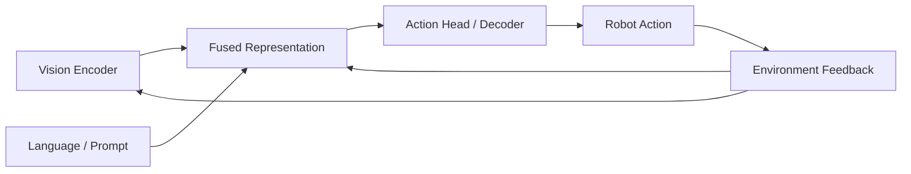

  

# Vision-Language-Action

> **A VLA system is a promise:** that seeing and understanding can become doing.

  

---

## What this topic is really about

Vision-Language-Action (VLA) asks how a robot should turn **visual context + natural-language intent** into **closed-loop action**.

That sounds simple. In practice it combines at least five difficult interfaces:

- language grounding
- visual attention and task relevance
- action representation
- temporal consistency
- recovery under execution drift

A VLA model becomes impressive only when the chain from **instruction → grounding → action** stays coherent under uncertainty.

---

## Research map

---

## Typical problem decomposition

| Component | The hidden question |
|---|---|
| visual grounding | which objects, regions, or relations matter for this instruction? |
| language grounding | how do vague or underspecified words become task-relevant constraints? |
| action interface | should the model predict low-level control, action chunks, diffusion trajectories, or tokenized actions? |
| memory | what keeps task identity stable over long horizons? |
| adaptation | what happens when the scene or execution deviates from the nominal path? |

---

## Main technical routes

### 1. Language-conditioned behavior cloning
The most direct route: learn a policy from demonstrations with text as task context.

### 2. Vision-language backbone + action head
Repurpose a powerful multimodal encoder and attach an action decoder.

### 3. Tokenized or chunked action modeling
Convert action into discrete or chunked outputs so that sequence models can operate more naturally.

### 4. Large-scale robot pretraining
Pretrain on diverse robot datasets and fine-tune to a downstream embodiment or task family.

### 5. Hierarchical or memory-augmented VLA
Separate high-level reasoning from low-level control, or explicitly model longer context.

---

## Must-read papers

| Paper | Venue / Year | Why it matters | Links |
|---|---|---|---|
| RT-1: Robotics Transformer for Real-World Control at Scale | arXiv 2022 | Canonical large-scale transformer control paper; strong early evidence for scalable robot policy learning | [Paper](https://arxiv.org/abs/2212.06817) |
| RT-2: Vision-Language-Action Models | 2023 | Clear statement of the VLA recipe: actions as text tokens inside a vision-language model | [Project](https://robotics-transformer2.github.io/) |
| PaLM-E: An Embodied Multimodal Language Model | arXiv 2023 | Important for embodied grounding and multimodal foundation-model thinking | [Paper](https://arxiv.org/abs/2303.03378) |
| Open X-Embodiment: Robotic Learning Datasets and RT-X Models | ICRA 2024 | The data backbone behind much recent generalist robotics work | [Project](https://robotics-transformer-x.github.io/) · [Code](https://github.com/google-deepmind/open_x_embodiment) |
| Octo: An Open-Source Generalist Robot Policy | 2024 | A practical open-source generalist robot policy with flexible observation and action definitions | [Project](https://octo-models.github.io/) · [Code](https://github.com/octo-models/octo) |
| OpenVLA: An Open-Source Vision-Language-Action Model | CoRL 2024 | The most practical open VLA reference stack for fine-tuning and downstream adoption | [Project](https://openvla.github.io/) · [Code](https://github.com/openvla/openvla) |
| VIMA: General Robot Manipulation with Multimodal Prompts | ICML 2023 | Strong prompt-centric view of manipulation; useful for multimodal task specification | [Project](https://vimalabs.github.io/) · [Paper](https://arxiv.org/abs/2210.03094) · [Code](https://github.com/vimalabs/vima) |
| PerAct: A Multi-Task Transformer for Robotic Manipulation | CoRL 2022 | A very influential 3D language-conditioned manipulation baseline | [Project](https://peract.github.io/) · [Code](https://github.com/peract/peract) |

---

## Benchmarks and datasets that matter

| Resource | Why it matters | Links |
|---|---|---|
| Open X-Embodiment | multi-lab, multi-embodiment real-robot data mixture | [Project](https://robotics-transformer-x.github.io/) |
| BridgeData V2 | accessible real-robot dataset for scalable manipulation and goal/language conditioning | [Project](https://rail-berkeley.github.io/bridgedata/) |
| CALVIN | long-horizon language-conditioned manipulation benchmark | [Project](https://calvin.cs.uni-freiburg.de/) · [Code](https://github.com/mees/calvin) |
| LIBERO | transfer- and lifelong-learning oriented benchmark suites | [Project](https://libero-project.github.io/main.html) · [Code](https://github.com/Lifelong-Robot-Learning/LIBERO) |
| RLBench | diverse language-like task variations in simulation; very common in manipulation papers | [Website](https://sites.google.com/view/rlbench) · [Code](https://github.com/stepjam/RLBench) |

---

## Open-source project stack

| Project | Best use case | Links |
|---|---|---|
| OpenVLA | fine-tuning and evaluating an open VLA on robot data | [Project](https://openvla.github.io/) · [Code](https://github.com/openvla/openvla) |
| Octo | lightweight starting point for generalist robot policy research | [Project](https://octo-models.github.io/) · [Code](https://github.com/octo-models/octo) |
| PerAct | 3D language-conditioned manipulation baseline on RLBench | [Project](https://peract.github.io/) · [Code](https://github.com/peract/peract) |
| LeRobot | practical training/deployment ecosystem with policies, datasets, and docs | [Hub](https://huggingface.co/lerobot) · [Code](https://github.com/huggingface/lerobot) |
| BridgeData V2 codebase | goal-conditioned / language-conditioned learning on real robot data | [Code](https://github.com/rail-berkeley/bridge_data_v2) |

---

## Where VLA systems usually break

### 1. The instruction is grounded, but not operational
The system knows what the words refer to, but cannot turn them into a robust executable sequence.

### 2. The action space is expressive, but brittle
A model may predict plausible action tokens while still failing at precise control.

### 3. Language helps at the beginning, then disappears
The instruction shapes early action but not long-horizon recovery.

### 4. Generality is claimed at the wrong level
The model generalizes over prompts or scenes, but not over recoverable execution.

---

## Build-first reading order

### If you want a practical stack
1. Open X-Embodiment  
2. Octo  
3. OpenVLA  
4. BridgeData V2 / LIBERO / CALVIN evaluation

### If you want a conceptual stack
1. RT-1  
2. RT-2  
3. PaLM-E  
4. OpenVLA and recent open-source descendants

### If you want a 3D manipulation bridge
1. PerAct  
2. VIMA  
3. OpenVLA  
4. Compare action representations and benchmarks

---

## Common pitfalls when reading VLA papers

- confusing **semantic understanding** with **reliable control**
- comparing methods across incompatible action spaces
- trusting offline prediction metrics too much
- ignoring recovery behavior in long-horizon tasks
- overlooking embodiment mismatch in dataset mixtures

---

## A good first project

Pick one benchmark and one action interface.

Suggested combinations:
- **OpenVLA + BridgeData V2**
- **PerAct + RLBench**
- **Octo + Open X subset**
- **LeRobot ACT/OpenVLA + a small real or simulated setup**

Then evaluate three things:
1. what language changes,
2. what action representation helps,
3. where failure first appears in closed loop.

---

## Related paper lists

- [Topic paper list — VLA](../paper_lists/by_topic/vla.md)
- [CoRL selections](../paper_lists/by_conference/corl.md)
- [ICML selections](../paper_lists/by_conference/icml.md)
- [ICRA selections](../paper_lists/by_conference/icra.md)

---

## Closing thought

The most interesting VLA models are not the ones that **sound** intelligent.  
They are the ones that make language matter precisely where action becomes hard.
