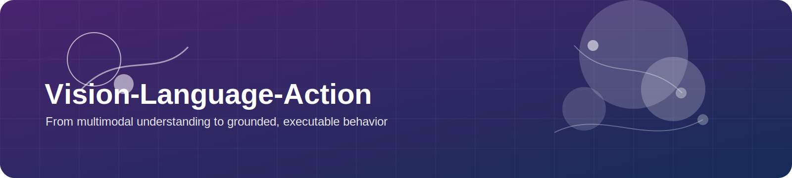
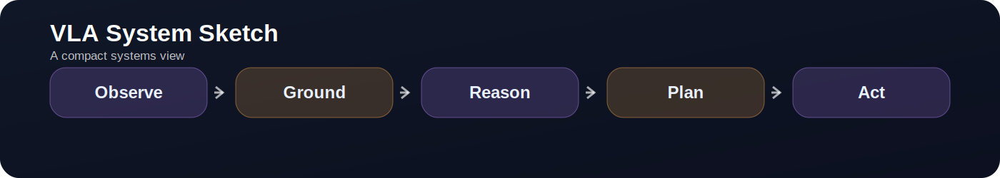

  

# Vision-Language-Action

> **A VLA system is a promise:** that seeing and understanding can become doing, and that the loop still holds after the first mistake.

  

---

## In-page Navigation

- [Topic Thesis](#topic-thesis)
- [Why This Topic Matters](#why-this-topic-matters)
- [Problem Decomposition](#problem-decomposition)
- [Core Technical Routes](#core-technical-routes)
- [Classical Backbone](#classical-backbone)
- [Frontier Watchlist (2025-2026)](#frontier-watchlist-2025-2026)
- [Open-source Projects & Toolchains](#open-source-projects--toolchains)
- [Datasets / Benchmarks / Simulators](#datasets--benchmarks--simulators)
- [Academic Labs & Company Systems](#academic-labs--company-systems)
- [Practical Build Paths](#practical-build-paths)
- [Common Failure Modes](#common-failure-modes)
- [Reading Sequence](#reading-sequence)
- [Research Radar](#research-radar)
- [Open Questions](#open-questions)

---

## Topic Thesis

VLA is not just multimodality. It is the attempt to keep this chain coherent:

**instruction -> grounding -> action -> recovery**

A VLA system becomes useful when it answers four things together:

1. what language changes
2. how action is represented
3. how the system recovers after drift or ambiguity
4. how much of the stack transfers across embodiments

---

## Why This Topic Matters

VLA became the public face of embodied AI because it gives the field an intuitive interface:

- the robot sees
- the human speaks
- the robot acts

But the real importance is deeper. VLA sits at a junction where:

- semantics must become task-relevant rather than descriptive
- perception must expose controllable state
- action must remain executable under latency and contact
- data must scale across tasks, labs, and embodiments

That is why VLA is both a model-design problem and a systems problem.

---

## Problem Decomposition

### 1. Instruction grounding

Which entities, regions, constraints, and success conditions become active for the current command?

### 2. Action representation

What does the model actually emit?

- joint deltas
- end-effector commands
- action chunks
- skill tokens
- hierarchical plans plus low-level control

### 3. Closed-loop execution

How does the system detect and repair:

- ambiguous goals
- occlusions
- failed grasps
- scene changes
- incomplete execution

### 4. Cross-embodiment transfer

What remains stable when moving from one robot to another?

- visual-language backbone
- policy trunk
- action head
- retargeting layer
- controller

### 5. Data scaling

How much performance comes from:

- more robot trajectories
- more embodiments
- internet-scale vision-language priors
- simulation and synthetic data
- post-training or RL refinement

---

## Core Technical Routes

### Route A: language-conditioned behavior cloning

Fastest path to a working baseline.

Best for: low-cost real robots, direct imitation, narrow task families.

### Route B: pretrained VLM plus action head

Strong when semantics and open-vocabulary grounding matter more than raw motor precision.

Best for: open-vocabulary instructions, compositional descriptions, semantic transfer.

### Route C: large-scale robot pretraining

Build a reusable robot prior across tasks, labs, and embodiments.

Best for: fine-tuning and cross-task generalization.

### Route D: hierarchical VLA

Separate reasoning and subgoal selection from low-level motor control.

Best for: long-horizon tasks and systems that must remain debuggable.

### Route E: on-device and whole-body VLA

Push inference closer to the robot and broaden from tabletop control to room-scale autonomy.

Best for: humanoids, mobile manipulation, low-latency deployment.

### Representative systems matrix

| System | Main strength | Action style | Best use |
|---|---|---|---|
| RT-1 | scalable robot transformer baseline | direct action tokens / trajectories | understanding early large-scale policy design |
| RT-2 | internet-scale semantics transfer | language-grounded action | seeing how VLM semantics changed robotics |
| PaLM-E | embodied multimodal reasoning | multimodal prompting plus control | reasoning-oriented embodied model framing |
| Octo | open generalist policy | cross-task policy head | reproducible pretraining and fine-tuning |
| OpenVLA | open VLA baseline | direct visuomotor policy | practical open-source experiments |
| pi0 | general-purpose robot policy framing | integrated generalist control | frontier system comparison |
| Gemini Robotics | reasoning plus VLA stack | VLA with embodied reasoning | frontier direction tracking |
| GR00T | humanoid-oriented foundation stack | whole-body and platform-adjacent control | humanoid ecosystem watching |
| Helix | full-body humanoid execution | whole-body action sequence | deployment-oriented industrial signal |
| Seed GR-3 | large-scale real-world VLA | generalist robotic action | post-training and industrial frontier signal |

---

## Classical Backbone

| Work | Why it still matters | Labels |
|---|---|---|
| [RT-1](https://robotics-transformer1.github.io/) | early large-scale transformer policy for robot control | classical |
| [RT-2](https://robotics-transformer2.github.io/) | showed internet-scale semantics transferring into robotic action | classical |
| [PaLM-E](https://palm-e.github.io/) | major milestone for embodied multimodal reasoning | classical |
| [Open X-Embodiment](https://robotics-transformer-x.github.io/) | largest open robot-data ecosystem anchor | classical, open-source |
| [Octo](https://octo-models.github.io/) | strong open generalist policy reference | classical, open-source, reproducible |
| [OpenVLA](https://openvla.github.io/) | open VLA baseline with immediate practical value | classical, open-source, reproducible, beginner-friendly |
| [pi0](https://www.physicalintelligence.company/blog/pi0) | general-purpose robot policy framing from Physical Intelligence | classical, industrial-signal |
| [VIMA](https://vimalabs.github.io/) | influential prompting-first framing for multimodal robot manipulation | classical |

---

## Frontier Watchlist (2025-2026)

| Work | Why it matters | Labels |
|---|---|---|
| [Gemini Robotics](https://deepmind.google/models/gemini-robotics/) | high-profile frontier VLA family from Google DeepMind | frontier-2025-2026, industrial-signal |
| [Gemini Robotics-ER](https://deepmind.google/models/gemini-robotics/gemini-robotics-er/) | explicit embodied reasoning layer for planning and success detection | frontier-2025-2026, industrial-signal |
| [Gemini Robotics On-Device](https://deepmind.google/models/gemini-robotics/gemini-robotics-on-device/) | signals serious movement toward on-robot inference | frontier-2025-2026, industrial-signal |
| [Helix](https://www.figure.ai/helix) | Figure's public framing of a generalist humanoid VLA stack | frontier-2025-2026, industry-system, industrial-signal |
| [Helix 02](https://www.figure.ai/news/helix-02) | full-body extension from upper-body control to room-scale behavior | frontier-2025-2026, industry-system, industrial-signal |
| [Isaac GR00T N1](https://developer.nvidia.com/isaac/gr00t) | NVIDIA's open humanoid foundation-model line enters the public stack | frontier-2025-2026, industrial-signal |
| [GR00T N1.5](https://research.nvidia.com/labs/gear/gr00t-n1_5/) | stronger post-training and real-robot signal for humanoids | frontier-2025-2026, industrial-signal |
| [Seed GR-3](https://seed.bytedance.com/GR3) | large-scale VLA with emphasis on real-world generalization | frontier-2025-2026, industrial-signal |
| [GR-RL](https://seed.bytedance.com/en/gr_rl) | shows RL entering post-training for generalist robot policies | frontier-2025-2026, industrial-signal |
| [RynnVLA-001](https://github.com/alibaba-damo-academy/RynnVLA-001) | open embodied VLA release from Alibaba DAMO | frontier-2025-2026, open-source, reproducible |

---

## Open-source Projects & Toolchains

| Project | Why it matters | Labels |
|---|---|---|
| [OpenVLA](https://github.com/openvla/openvla) | practical fine-tuning and inference path | open-source, reproducible, beginner-friendly, build-path |
| [Octo](https://github.com/octo-models/octo) | strong generalist policy baseline | open-source, reproducible, build-path |
| [Open X-Embodiment](https://github.com/google-deepmind/open_x_embodiment) | anchor dataset and training ecosystem | open-source, reproducible |
| [LeRobot](https://huggingface.co/docs/lerobot/index) | clean path from hosted data to low-cost hardware | open-source, beginner-friendly, build-path |
| [robomimic](https://robomimic.github.io/) | excellent BC-first baseline and evaluation toolkit | open-source, reproducible, beginner-friendly, build-path |
| [ACT](https://github.com/tonyzhaozh/act) | practical action-chunking baseline for real manipulation | open-source, reproducible, build-path |
| [RynnVLA-002](https://github.com/alibaba-damo-academy/RynnVLA-002) | open frontier-adjacent release worth watching | frontier-2025-2026, open-source, reproducible |

---

## Datasets / Benchmarks / Simulators

| Resource | Why it matters | Best use |
|---|---|---|
| [Open X-Embodiment](https://robotics-transformer-x.github.io/) | largest open robot-data anchor | pretraining context |
| [BridgeData V2](https://rail-berkeley.github.io/bridgedata/) | practical manipulation fine-tuning data | open-source VLA fine-tuning |
| [CALVIN](https://github.com/mees/calvin) | instruction-conditioned long-horizon benchmark | closed-loop VLA comparison |
| [LIBERO](https://libero-project.github.io/main.html) | compositional and lifelong manipulation evaluation | transfer and generalization |
| [BEHAVIOR-1K](https://behavior.stanford.edu/index.html) | household task breadth | human-centered embodied scope |
| [ManiSkill](https://maniskill.ai/) | scalable manipulation simulation | simulation-first experimentation |

---

## Academic Labs & Company Systems

| Node | Why track it | Representative signals |
|---|---|---|
| Stanford | household and mobile manipulation systems | Mobile ALOHA, TidyBot++, BEHAVIOR |
| Berkeley | robot data and generalist policy scaling | Open X-Embodiment, BridgeData V2, Octo |
| Google DeepMind | frontier VLA and deployment-oriented robotics stack | Gemini Robotics, MuJoCo Playground |
| NVIDIA | humanoid platform plus simulator infrastructure | GR00T, Isaac Lab |
| Physical Intelligence | generalist policy framing and frontier signal | pi0 |
| Figure | humanoid whole-body VLA narrative | Helix, Helix 02 |
| ByteDance Seed | VLA plus RL post-training | GR-3, GR-RL |
| Alibaba DAMO | open embodied releases from a major industrial lab | RynnVLA line |

---

## Practical Build Paths

### Build Path A: open-source VLA baseline

Use [VLA Entry](../build_paths/vla_entry.md) with OpenVLA or Octo on CALVIN or LIBERO.

Best for: first reproducible VLA system.

### Build Path B: low-cost real robot route

Use LeRobot or ACT with a narrow tabletop task family and a small teleop dataset.

Best for: builders who care about real execution more than headline model scale.

### Build Path C: frontier system analysis

Read Gemini Robotics, GR00T, Helix, and Seed GR-3 side by side, but compare them through action interface, recovery loop, and embodiment assumptions.

Best for: readers studying where the frontier is moving, not just what model is newest.

---

## Common Failure Modes

- strong semantics but weak motor precision
- treating language success as task success
- offline benchmark gains without closed-loop recovery gains
- cross-embodiment claims that hide action-head or calibration assumptions
- policy outputs that look elegant but are hard to debug on real robots

---

## Reading Sequence

### Beginner

1. Open X-Embodiment
2. Octo
3. OpenVLA
4. BridgeData V2

Goal: understand the data and action interface before chasing frontier releases.

### Intermediate

1. RT-1
2. RT-2
3. PaLM-E
4. pi0

Goal: compare where semantics enter and how action is represented.

### Advanced

1. Gemini Robotics family
2. GR00T line
3. Helix line
4. Seed GR-3 and GR-RL

Goal: track whole-body control, on-device deployment, and post-training trends.

---

## Research Radar

Watch these questions now:

- where should reasoning live inside the robot stack
- how much RL should enter VLA post-training
- what part of the stack can move on-device
- how much embodiment transfer can be bought with data versus retargeting

---

## Open Questions

- What is the right interface between language reasoning and low-level control?
- How should VLA systems represent action when embodiment changes frequently?
- When does post-training with RL materially help more than better demonstrations?
- Can affordance and world-model layers become standard modules inside VLA stacks?
- Which evaluation setups actually measure recovery, not only nominal success?

---

## Related Pages

- [Manipulation](manipulation.md)
- [World Models](world_model.md)
- [Benchmarks](../resources/benchmarks.md)
- [Industry Map](../maps/industry.md)
- [VLA Entry build path](../build_paths/vla_entry.md)
