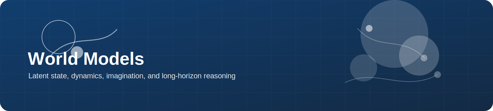
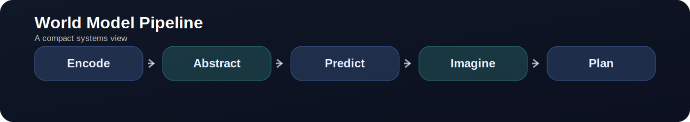
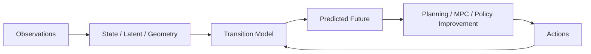

  

# World Models

> **A world model is not only a predictor. It is a choice of what future structure is worth imagining.**

  

---

## What this topic is really about

World models try to answer a deceptively simple question:

> **What internal model of the world makes action easier, safer, or more data efficient?**

In embodied AI, a world model can play different roles:

- a **latent simulator** for policy optimization
- a **predictive model** for planning and control
- a **3D or geometric dynamics model** for interaction forecasting
- a **memory mechanism** for long-horizon reasoning
- a **bridge across embodiments**, if actions are represented in a shared space

---

## Research map

---

## Three major families

### 1. Latent-dynamics world models
The classical model-based RL view: learn a compact latent state and imagine trajectories there.

### 2. Video / sequence world models
Predict future observations or tokens, often prioritizing rich visual rollout quality.

### 3. 3D / geometry-aware world models
Represent objects, surfaces, points, or scene geometry explicitly so that physical interaction is easier to model.

---

## Must-read papers

| Paper | Venue / Year | Why it matters | Links |
|---|---|---|---|
| PlaNet: Learning Latent Dynamics for Planning from Pixels | 2018 | Foundational latent-dynamics planning paper | [Paper](https://arxiv.org/abs/1811.04551) |
| Dream to Control: Learning Behaviors by Latent Imagination | 2019 | The Dreamer line begins here; key for imagined rollouts | [Paper](https://arxiv.org/abs/1912.01603) |
| DreamerV2: Mastering Atari with Discrete World Models | 2020 | Mature latent-world-model RL recipe with strong performance | [Paper](https://arxiv.org/abs/2010.02193) · [Code](https://github.com/danijar/dreamerv2) |
| DreamerV3: Mastering Diverse Domains through World Models | Nature / 2025 | Strongest general reference for robust, scalable world-model RL | [Paper](https://arxiv.org/abs/2301.04104) · [Code](https://github.com/danijar/dreamerv3) |
| TD-MPC2: Scalable, Robust World Models for Continuous Control | ICLR 2024 | A practical model-based control baseline that matters for continuous-control robotics | [Project](https://www.tdmpc2.com/) · [Code](https://github.com/nicklashansen/tdmpc2) |
| PointWorld: Scaling 3D World Models for In-The-Wild Robotic Manipulation | 2026 | Important 3D world-model direction using point-flow state and action representations | [Project](https://point-world.github.io/) · [Paper](https://arxiv.org/abs/2601.03782) · [Code](https://github.com/NVlabs/PointWorld) |

---

## Why world models matter in robotics

| Use case | Why a world model helps |
|---|---|
| data efficiency | imagined rollouts reduce the burden on real interaction |
| planning | future states can be scored before acting |
| recovery | multi-step prediction can reveal drift earlier |
| interaction modeling | articulated, deformable, or tool-based tasks need future structure |
| embodiment transfer | shared geometric representations can generalize beyond robot-specific joints |

---

## Practical open-source stack

| Project | Best use case | Links |
|---|---|---|
| DreamerV3 | robust starting point for imagined-rollout RL | [Code](https://github.com/danijar/dreamerv3) |
| TD-MPC2 | continuous-control and multitask model-based control | [Project](https://www.tdmpc2.com/) · [Code](https://github.com/nicklashansen/tdmpc2) |
| MuJoCo Playground | GPU-accelerated training and sim-to-real-oriented experiments | [Website](https://playground.mujoco.org/) · [Code](https://github.com/google-deepmind/mujoco_playground) |
| PointWorld | action-conditioned 3D world modeling for manipulation | [Project](https://point-world.github.io/) · [Code](https://github.com/NVlabs/PointWorld) |
| RoboNet | classic multi-robot dataset for video prediction and visual dynamics | [Blog](https://bair.berkeley.edu/blog/2019/11/26/robo-net/) · [Code](https://github.com/SudeepDasari/RoboNet) |

---

## Datasets and environments that fit this topic

| Resource | Why it matters | Links |
|---|---|---|
| RoboNet | classic dataset for large-scale visual dynamics and transfer across robot platforms | [Paper](https://arxiv.org/abs/1910.11215) |
| Open X-Embodiment | useful when studying embodiment diversity or action-interface alignment | [Project](https://robotics-transformer-x.github.io/) |
| ManiSkill | broad manipulation tasks for model-based or data-driven control experiments | [Website](https://www.maniskill.ai/) |
| Meta-World / DMControl / MyoSuite | common control benchmarks used in TD-MPC2-style evaluations | [TD-MPC2 page](https://www.tdmpc2.com/) |

---

## How to read world-model papers

Ask these questions:

1. **What is the state representation?**  
   Latent categories? observations? tokens? point flow? object slots?

2. **How does action enter the model?**  
   Robot-specific joints? end-effector control? embodiment-agnostic geometry?

3. **What is predicted?**  
   Reward only? latent state? images? 3D flow? contact-relevant structure?

4. **How is the model used?**  
   Policy optimization? MPC? action scoring? demonstration synthesis?

5. **What makes the model fail?**  
   Long horizon? contact discontinuity? partial observability? embodiment shift?

---

## Common failure modes

- visually plausible but physically wrong rollouts
- compounding error over long horizons
- latent states that are compact but not actionable
- action representations that lock the model to one robot embodiment
- good simulator results without a viable bridge to real sensing

---

## Build-first project ideas

### Practical starter
Train a DreamerV3 or TD-MPC2 baseline on a small manipulation/control benchmark, then inspect where imagined rollouts diverge.

### Geometry-aware starter
Use PointWorld-like 3D forecasting ideas on a reduced tabletop setup and evaluate action-conditioned point prediction.

### Research-oriented starter
Compare robot-specific action inputs against geometry-aware or end-effector-centric action representations and measure transfer across embodiments.

---

## Related paper lists

- [Topic paper list — World Models](../paper_lists/by_topic/world_model.md)
- [ICLR selections](../paper_lists/by_conference/iclr.md)
- [T-RO selections](../paper_lists/by_journal/tro.md)

---

## Closing thought

A good world model is not the one that predicts the future most beautifully.  
It is the one that makes **decision-making under embodiment and physics** easier.
